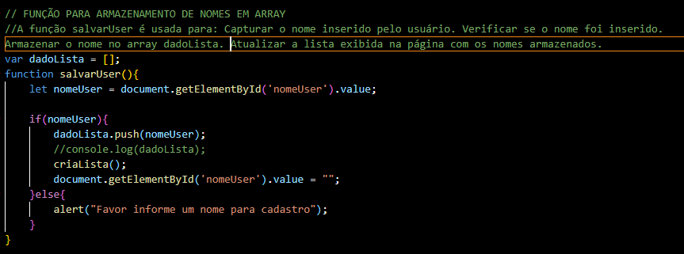
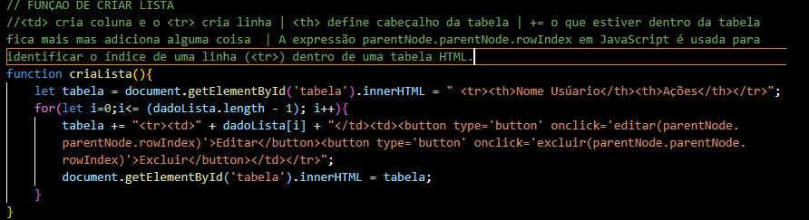
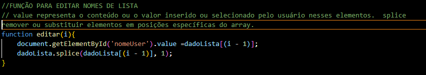
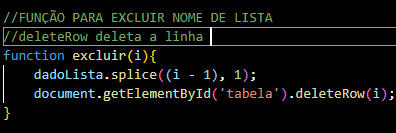
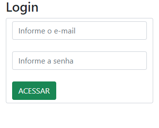
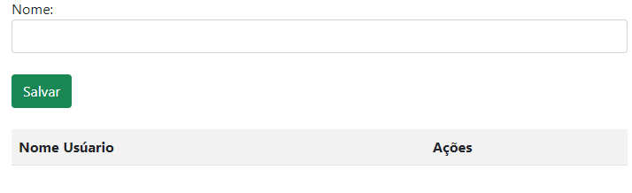

# Validação de Acesso e Gerenciamento de Lista de Usuários

*Disciplina:* Desensivolvimento Web

*Professor*: [Leonardo Santiago Sidon da Rocha](https://github.com/LeonardoRochaMarista/)

Este projeto consiste em uma simples aplicação web que permite aos usuários fazer login e gerenciar uma lista de nomes de usuários. O projeto inclui duas páginas HTML: uma página de login e uma página de cadastro. O código JavaScript associado realiza a validação dos campos de login e a manipulação da lista de usuários.

# Funcionalidades

1. Validação de Acesso

O código de validação de acesso é responsável por verificar se os campos de login (e-mail e senha) estão preenchidos. Caso os campos estejam preenchidos corretamente, o usuário é redirecionado para a página de cadastro. Caso contrário, uma mensagem de alerta é exibida solicitando o preenchimento de todos os campos.

2. Armazenamento de Nomes em um Array

A função `salvarUser` armazena os nomes dos usuários em um array (`dadoLista`). Se o nome do usuário for informado, ele é adicionado ao array, a lista é atualizada na tela, e o campo de entrada é limpo. Se o campo estiver vazio, uma mensagem de alerta é exibida solicitando que um nome seja informado. 

3. Criação de Lista de Usuários

A função `criaLista` é responsável por gerar dinamicamente uma tabela HTML que exibe os nomes armazenados no array `dadoLista`. Além de exibir os nomes, a tabela também inclui botões para editar e excluir os usuários da lista.

4. Edição de Usuários

A função `editar` permite que o nome de um usuário seja editado. Quando o botão "Editar" é clicado, o nome do usuário correspondente é preenchido no campo de entrada para edição. Em seguida, o nome antigo é removido do array.

5. Exclusão de Usuários

A função excluir remove um nome da lista e também remove a linha correspondente da tabela HTML.

# Estrutura do Projeto 

O projeto é composto por dois arquivos HTML (`login.html e cadastro.html`) e um arquivo JavaScript (`controller.js`) que contém todas as funções descritas acima.

`login.html`

Esta página contém o formulário de login. Quando o botão "ACESSAR" é clicado, a função `acessar()` é chamada para validar os campos e, se estiverem corretos, redirecionar para a página de cadastro.

`cadastro.html`

Esta página contém o formulário para inserir o nome do usuário e a tabela que exibe os nomes cadastrados. As funções `salvarUser()`, `criaLista()`, `editar()`, e `excluir()` são utilizadas nesta página para gerenciar a lista de usuários.

`controller.js`

Este arquivo contém todas as funções JavaScript mencionadas acima e é referenciado por ambas as páginas HTML.

      

